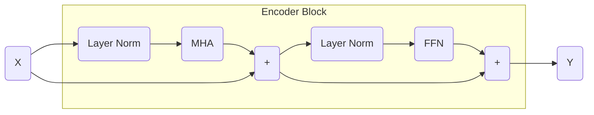
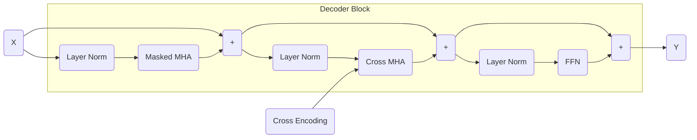

Transformers and Attention
==============
# Attention
## Scaled Dot-Product Attention
* In scaled dot product attention, we are given input queries $Q$, keys $K$, and values $V$.
* We want to calculate the output as a weighted average of values $V$ based on the similarity between queries $Q$ and keys $K$. 
* Attention correspond to the weight we give to values $V$ based on queries $Q$ and keys $K$.
* We can calculate scaled dot product attention as follows: 
    1. Calculate scaled similarity between queries and keys using the dot product.
    2. Apply a softmax function to obtain the attention weights.
    3. Take the weight average of values $V$ using attention weights to get the output.

$$
\begin{gather*}
Y = \text{Attention}(Q, K, V) = \text{softmax}\left(\frac{QK^T}{\sqrt{d_k}}\right) V
\end{gather*}
$$

* For each of our queries we get one output vector of dimension $d'$ ($Y \in \mathbb{R}^{n \times d'}$)
* Self-attention refers to attention where the queries, keys, and values are all from the same input sequence. As opposed to cross attention where the queries can come from a different input sequence as the keys and values.
* In practice, self-attention computes the query, key, and value by appling three weight matrices $W^Q$, $W^K$, and $W^V$ respectively on input $X$.

## Multi-Head Attention (MHA)
* Sometimes attention depends on different aspects of the input sequence. To capture this intuition, we want to give attention layers different representations of the input sequence $X$.
* We calculate multiple queries, keys, and values by applying different weight matrices $W^Q_i$, $W^K_i$, and $W^V_i$ respectively on the input where $i$ is the index of the head. 
* We then concatenate the outputs of each head and apply a final weight matrix $W^O$ to get the final output.

# Transformers
## Input Embeddings
* There are two embeddings in a transformer model: token embeddings and positional embeddings.
    * Token embeddings are learned embeddings for each token in the input sequence.
    * Positional embeddings are learned embeddings for the position of each token in the input sequence. 
        * Note that self-attention removes the notion of ordering so we must encode the ordering in the input.
        * Positional embeddings may or may not be trained 
* The final embedding is the sum of the token and positional embeddings.

## Encoder
* There are three main components in the encoder block: multi-head attention, feed-forward neural network, and normalization layers.
* Pre-LN refers to applying the layer normalization before attention and FF layers. Post-LN refers to applying the layer normalization after attention and FF layers.
* 

## Decoder
* The decoder block is similar to the encoder block but has two differences
    1. Multi-head self-attention is masked to prevent the decoder from looking at future tokens.
    2. The decoder block has an additional multi-head cross attention layer that takes the encoder output as input.
* To mask multi-head self-attention, we zero out the upper triangular part of the attention matrix that way the decoder can only use previous context to represent tokens. Let $M$ be mask matrix where the lower triangular part is 1 and the rest is $-\infty$.   

$$
\begin{gather*}
Y = \text{MaskedAttention}(Q, K, V) = \text{softmax}\left(M \odot \frac{QK^T}{\sqrt{d_k}}\right) V
\end{gather*}
$$

* In multi-head cross attention, we use the encoder output as the keys and values and the decoder output as the queries.

## Output Layer
* Usually we apply a linear layer to the output of the transformer to get the output dimensions in the right format. 
* For example, if we wanted to generate the next token in a sequence, we would apply a linear layer to get a vector with dimensions equal to the number of tokens in the vocabulary. We then feed it into a softmax layer to get the probability of the next token. 

## Types of Transformers
* Encoder-only transformers are transformers with only encoder blocks. Likewise decoder-only transformers are transformers with only decoder blocks. 
    * Decoder-only transformers do not have the cross-attention layer.
* Here are the main uses of each type of transformer: 

|Type|Common Usage|Examples|
|:-:|:-:|:-:|
|Encoder-Only|Discriminitive analysis of text such as sentiment classificaiton, entity recognition, etc... |BeRT|
|Decoder-Only|Generative tasks such as summarization, question-answering, etc... |GPT-X|
|Encoder-Decoder|Sequence-to-sequence tasks such as translation|Original transformer|

